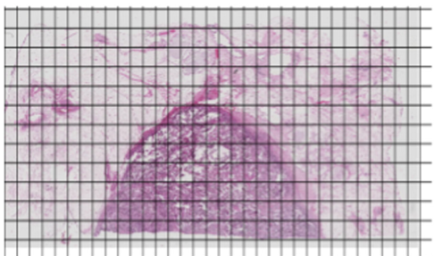

# 使用openslide对WSI图像进行相关任务的技巧

##  涉及的package

``PIL``
``matplotlib.pyplot``
``opencv-python``
``openslide-python``
``tensorflow``
``Keras``
``torch``


## 关于openslide使用的必须的注意事项

### 兼容格式
实际上openslide很多使用习惯和python自带的**PIL**相同，首先不管是``slide.get_thumbnail(level)``方法还是``slide.read_region((w_coordinate, h_coordinate), level, (patch_w, patch_h))``方法，返回的对象都是Image对象而非numpy array对象。因此为便于对返回的Image对象进行后续处理，一般都会将其转换为数组。由于Image对象，所以默认的通道顺序自然也是RGB，只需要直接使用``np.array()``方法则可:
``region_img_arr =  np.array(slide.read_region((w_coordinate, h_coordinate), level, (patch_w, patch_h)))``
但需要注意的是，直接转换为数组时候，其通道数的深度并非为3而是4，因为获取的数组，实际上是包含了alpha通道(透明度)，即转换后的数组，第三维度依次是**[R,G,B,A]**。一般情况下这个WSI图像不存在透明度处理的问题，因此可以将这个通道直接丢弃，只取前三个通道，保证进行np.array转换后能兼容常规的图像处理工具格式则可，如：
``region_img_arr =  np.array(slide.read_region((w_coordinate, h_coordinate), level, (patch_w, patch_h)))[:,:,:3]``


### 坐标顺序
之后是坐标顺序，
实际上openslide很多使用习惯和python自带的**PIL**相同，首先不管是``slide.get_thumbnail(level)``方法还是``slide.read_region((w_coordinate, h_coordinate), level, (patch_w, patch_h))``方法又或者是``slide.level_dimensions[level]``，牵涉到坐标的设置，都是**(图像的宽，图像的高)**，和array中矩阵的顺序(图像的高，图像的宽)刚好相反，如：

因此，上述所有参数都是先width, 之后才是height，而基于numpy array的skimage、cv2甚至是scipy这些包，处理图像(矩阵)时，都是先height, 之后才是width，如
``img[height,width]``


## 处理WSI大图文件的思路
正是因为WSI图像原图非常大，在一般情况下没有办法直接处理，所以要才要借助于openslide。然而，使用openslide虽然也有方法能提取整张图像的缩略图(如``slide.get_thumbnail(level)``方法),只是这样做并非是使用openslide进行处理的初衷，实际上，我们只所以要使用openslide，是因为在不直接还原原图缩略图的情况下，又能像使用array对象一样，对感兴趣的区域进行直接的提取，因此，更多时候，我们用的是openslide中区域截图提取的方法：
``slide.read_region((w_coordinate, h_coordinate), level, (patch_w, patch_h))``
该用方法的描述参看"**openslide_demo.py/.ipynb**",在这里要强调的是，在绝大多数情况下，我们是对原图0级没进行任何下采样的截图进行处理，所以上述的``level``参数默认为0。
对WSI进行全图处理的思想是，根据预设的视野大小(为patch_size×patch_size)，在全图中使用``slide.read_region()``方法进行遍历，再根据当前遍历到的位置进行相关判断或处理，如下图：


基本代码如下：

```python
def openslide_cut_patch(filename,label_result_dir,livel,patch_size,save_dir):
    """
    根据给出的label，在以patch size大小的窗口遍历svs原图时对相应区域进行采样
    :param filename:包绝对路径的文件名
    :param label_result_dir:svs图片对应的标注结果存放目录，每个numpy数组大小等同于对应svs图片livel下采样下的大小
    :param livel:svs处理的下采样的级数
    :param patch_size:移动的视野大小，等同于保存图片的大小
    :param save_dir:图片保存的路径
    :return:
    """
    level_downsamples = slide.level_downsamples[livel]
    w_count = int(slide.level_dimensions[0][0] // patch_size)
    h_count = int(slide.level_dimensions[0][1] // patch_size)
    #设定步长＝patch_size,根据WSI原图大小决定遍历多少个视野框
    for w in range (w_count):
        for h in range (h_count):
        	subHIC = np.array(slide.read_region((w * patch_size, h * patch_size), 0, (patch_size, patch_size)))[:,:,:3]
            # do some processing about subHIC
```
不管是进行截图采样还是全图预测，都是基于这个思路进行，但可能在不同的任务中会有不同的预处理和判断逻辑。

## 示例代码说明
### big_patch_transfrom_samping.py
使用openslide在WSI大图中通过切割大的patch做颜色转换以及后续处理步骤的demo程序
### label_get_patch.py
使用openslide在WSI大图中基于已有的mask进行采样的程序
### openslide_demo.py/.ipynb
openslide常用到的内置函数使用demo介绍
### predict_in_patch.py
使用openslide在WSI大图中切patch，然后调用深度学习模型预测，并保存预测结果的程序范例


