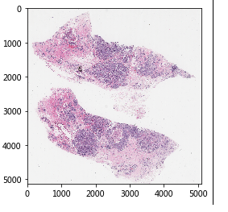
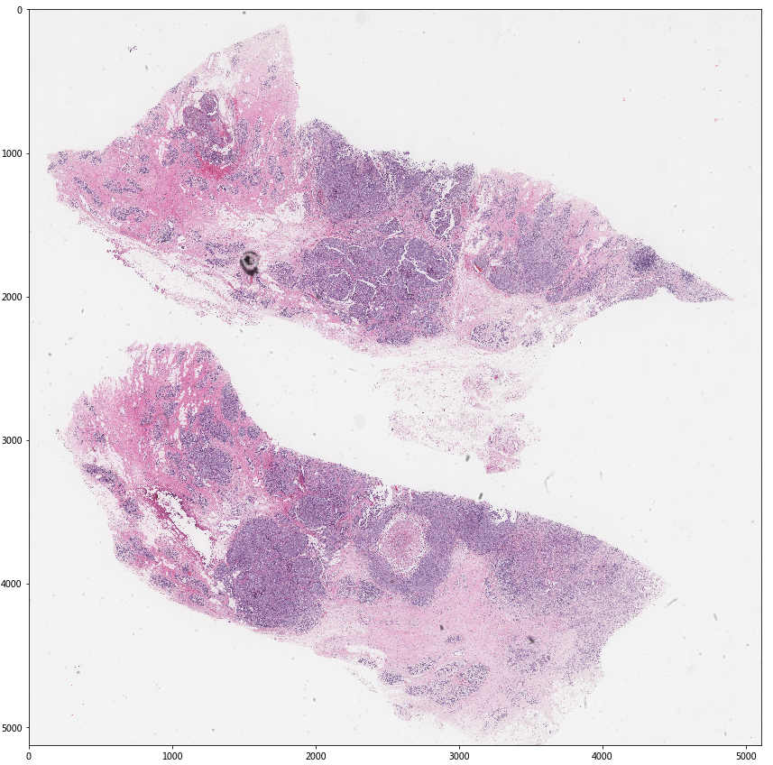
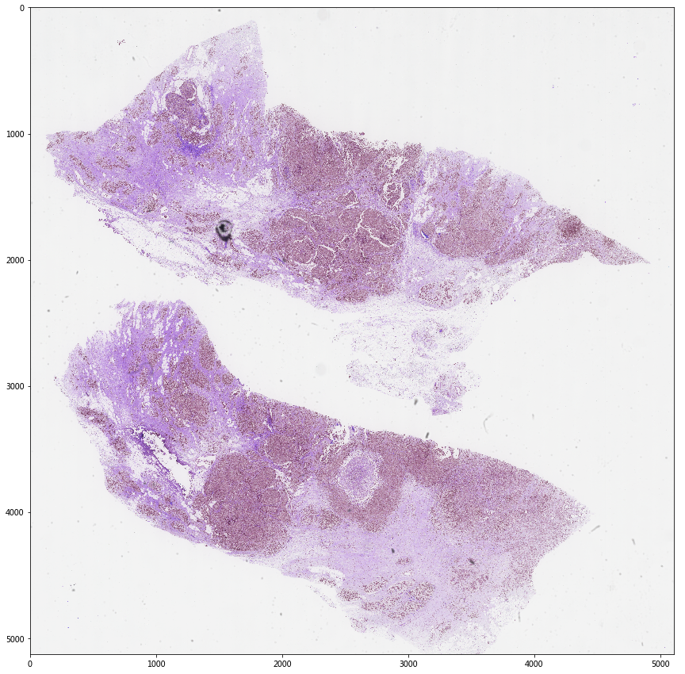
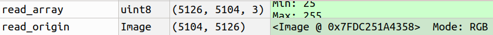

# 进行数据处理以及模型训练时必须注意的一些陷阱/技巧

##  涉及的package

``PIL``
``matplotlib.pyplot``
``opencv-python``
``openslide-python``
``tensorflow``
``Keras``
``torch``


## 大图对象操作
一般来说python可支持操作的图像类型的对象大小有上限的，这也是为什么自带的图像处理工具库`PIL`无法读取无法读取**WSI**(Whole Slide Image)格式的图片的原因，但如果仍坚持直接用`PIL`处理这些大图像对象(通常我们不建议这样做),可通过以下语句进行修改，突破默认的限制：

```python
from PIL import Image
Image.MAX_IMAGE_PIXELS=500000000 #这里可以设一个很大的数值
```

## 在IPython中画出大图
针对Spyder或者Jupyter Notebook这些集成IPython窗口的编译环境，如果希望用`matplotlib`能对一些大图(几千像素×几千像素级别)以比较友好的方式画出来时，需要手工指定画布大小，否则会按默认大小来显示，以下是原效果：

可通过以下语句重新指定画布大小：

```python
import matplotlib.pyplot as plt
plt.rcParams['figure.figsize'] = 15, 15
```
显示的效果如下：


## opencv-python 默认通道顺序
如果在模型训练前后的预处理过程中需要用到`opencv`来处理图像，必须要谨记的一点是，`opencv`默认读写图像的通道顺序并非是RGB而是**BGR**！！！！
### 读取图片
一般情况下，为了避免后续操作混乱，如果是用于模型训练/预测读取图片，尽量避免使用`opencv`进行图片读取，因为所有深度学习框架读取图片时默认都是RGB顺序(使用python内置的`PIL`读取)，关于RGB和BGR的差异，可以参看以下对比：
```python
import cv2
cv_test_read = cv2.imread('16558.png')
plt.imshow(cv_test_read)
```
显示的效果如下（注意和上图进行对比）：

为此，需要在使用`opencv`读取图片后，马上进行转换处理：
```python
import cv2
img = cv2.imread('16558.png')
img = cv2.cvtColor(img,cv2.COLOR_BGR2RGB)
#####如果确定更不需要使用opencv对图片进行处理，建议直接用skimage或者PIL库读取图像
import skimage.io as io
img = io.imread('16558.png')
```
### 保存图片
即使你的图片是RGB通道顺序的，但如果有使用`opencv`对图像进行修改(resize这些形态操作除外)，如画框、添加文字、以及相关变换等，就必须要要以`opencv`进行图片的保存，但需要注意的是，只要是使用`opencv`进行图片保存，都必须在处理前将图片转为BGR通道顺序，否则保存下来的图片并非是RGB下真实的颜色:
```python
import cv2
import skimage.io as io
img_new = cv2.rectangle(img, (int(nuclei_info[l,0]),int(nuclei_info[l,1])),(int(nuclei_info[l,0]+1),int(nuclei_info[l,1]+1)),color_flag_25,3)
cv2.imwrite(save_dir,cv2.cvtColor(img_new, cv2.COLOR_RGB2BGR))
#####如果确定更不需要使用opencv对图片进行处理，建议直接用skimage进行图片保存(前提是通道顺序必须是RGB)
io.imsave(save_dir,img)
```
### 使用深度学习框架进行预测
由于tensorflow/pytorch读取图像都是默认为RGB通道顺序的，在进行预测的时候，必须要确定图片不是BGR顺序的，否则预测的结果会相差很远。


## openslide的trick说明

### 兼容格式
实际上`openslide`很多使用习惯和python自带的`PIL`相同，首先不管是``slide.get_thumbnail(level)``方法还是``slide.read_region((w_coordinate, h_coordinate), level, (patch_w, patch_h))``方法，返回的对象都是Image对象而非numpy array对象。因此为便于对返回的Image对象进行后续处理，一般都会将其转换为数组。由于Image对象，所以默认的通道顺序自然也是RGB，只需要直接使用``np.array()``方法则可:
``region_img_arr =  np.array(slide.read_region((w_coordinate, h_coordinate), level, (patch_w, patch_h)))``
但需要注意的是，直接转换为数组时候，其通道数的深度并非为3而是4，因为获取的数组，实际上是包含了alpha通道(透明度)，即转换后的数组，第三维度依次是**[R,G,B,A]**。一般情况下这个WSI图像不存在透明度处理的问题，因此可以直接丢弃alpha通道，只取前三个通道，保证进行np.array转换后能兼容常规的图像处理工具格式则可，如：
``region_img_arr =  np.array(slide.read_region((w_coordinate, h_coordinate), level, (patch_w, patch_h)))[:,:,:3]``


### 坐标顺序
之后是坐标顺序，
实际上`openslide`很多使用习惯和python自带的`PIL`相同，首先不管是``slide.get_thumbnail(level)``方法还是``slide.read_region((w_coordinate, h_coordinate), level, (patch_w, patch_h))``方法又或者是``slide.level_dimensions[level]``，牵涉到坐标的设置，都是**(图像的宽，图像的高)**，和array中矩阵的顺序(图像的高，图像的宽)刚好相反，如：

因此，上述所有参数都是先width, 之后才是height，而基于numpy array的skimage、cv2甚至是scipy这些包，处理图像(矩阵)时，都是先height, 之后才是width，如
``img[height,width]``


## 使用深度学习框架加载ImageNet权重进行相关操作时
如果当前的场景需要加载ImageNet预训练权重，如果可以，建议同步相关的数据预处理方法，详见：
https://github.com/tensorflow/tensorflow/blob/r1.9/tensorflow/python/keras/applications/imagenet_utils.py
```python
def _preprocess_symbolic_input(x, data_format, mode):
  """Preprocesses a tensor encoding a batch of images.
  Arguments:
      x: Input tensor, 3D or 4D.
      data_format: Data format of the image tensor.
      mode: One of "caffe", "tf" or "torch".
          - caffe: will convert the images from RGB to BGR,
              then will zero-center each color channel with
              respect to the ImageNet dataset,
              without scaling.
          - tf: will scale pixels between -1 and 1,
              sample-wise.
          - torch: will scale pixels between 0 and 1 and then
              will normalize each channel with respect to the
              ImageNet dataset.
  Returns:
      Preprocessed tensor.
  """
  global _IMAGENET_MEAN

  if mode == 'tf':
    x /= 127.5
    x -= 1.
    return x

  if mode == 'torch':
    x /= 255.
    mean = [0.485, 0.456, 0.406]
    std = [0.229, 0.224, 0.225]
  else:
    if data_format == 'channels_first':
      # 'RGB'->'BGR'
      if K.ndim(x) == 3:
        x = x[::-1, ...]
      else:
        x = x[:, ::-1, ...]
    else:
      # 'RGB'->'BGR'
      x = x[..., ::-1]
    mean = [103.939, 116.779, 123.68]
    std = None

  if _IMAGENET_MEAN is None:
    _IMAGENET_MEAN = constant_op.constant(-np.array(mean), dtype=K.floatx())

  # Zero-center by mean pixel
  if K.dtype(x) != K.dtype(_IMAGENET_MEAN):
    x = K.bias_add(x, math_ops.cast(_IMAGENET_MEAN, K.dtype(x)), data_format)
  else:
    x = K.bias_add(x, _IMAGENET_MEAN, data_format)
  if std is not None:
    x /= std
  return x
```
以Keras为例，仅在训练的时候在 ImageDataGenerator指定rescale=1./255是不够的，实际上还需要自己额外进行去均值和标准差。ImageNet数据集的均值和标准差如下:
```
mean = [0.485, 0.456, 0.406]
std = [0.229, 0.224, 0.225]
```
以Keras为例，可以在ImageDataGenerator的引用中增设preprocessing_function的定义，如：
```python
from keras.preprocessing import image
from keras.applications.vgg16 import preprocess_input
from keras.preprocessing.image import ImageDataGenerator

def imagenet_processing(image):
	mean = [0.485, 0.456, 0.406]
	std = [0.229, 0.224, 0.225]
    for i in range(3):
    	image[:,:,i] -= mean[i]
        image[:,:,i] /= std[i]
    return image

train_datagen = ImageDataGenerator(
        rescale=1./255,
        horizontal_flip = True,
        vertical_flip = True,
        preprocessing_function = imagenet_processing
        )
train_generator = train_datagen.flow_from_directory(
        'train_dataset_dir',  # 训练数据路径
        target_size=(input_size_h, input_size_w),  # 设置图片大小
        batch_size=batch_size # 批次大小
        )

```

以pytorch为例，训练时可以在使用dataloader时，增加torchvision.transforms的Normalize方法的调用，如:
```python
from torchvision import datasets, transforms

mean = [0.485, 0.456, 0.406]
std = [0.229, 0.224, 0.225]
def get_dataloader():
    data_transforms = {
    'train':transforms.Compose([
            transforms.RandomHorizontalFlip(),
            transforms.ToTensor(),
            transforms.Normalize(mean,std)
            ]),
    'val':transforms.Compose([ transforms.ToTensor(),transforms.Normalize(mean,std)
    ]),}

    image_datasets = {x: datasets.ImageFolder(self.datapath[x],data_transforms[x]) for x in ['train', 'val']}
    dataloaders = {x: torch.utils.data.DataLoader(image_datasets[x], batch_size = self.batch_size, shuffle = True, num_workers=0)  for x in ['train', 'val']}
```


需要注意的是上述提及到的ImageNet权重数据预处理的方法和框架无关，只要是加载框架对应的模型的ImageNet预训练权重，都必须进行同样的预处理，只有这样才能真正发挥ImageNet预训练权重的作用。用于预测时同理。

    然而对于病理图像处理的场景,在加载ImageNet权重进行训练时，有没有对应的processing其实差别不大，反而有时候加了processing效果还会差一些。但另一方面，训练时没加这个processing，但预测是加上的话，效果可能会更理想(听上去有些不make sence)，所以还需要以来具体场景来确定是否添加。         		 ——By Kwong 2019.12


## 关于resize
不管训练还是预测，我们很可能会遇上**image_size**/**patch_size**和**model_input_size**/**target_size**不一致的情况。如果是训练，基本上不需要自己手工处理，大部分时可以用框架自带的数据读取方法来指定**resize**的大小，但往往在预测的时候，可能需要自己在外部对预测数据进行处理才放进模型，所以，这时候问题就会出现。不同风格不同大小的图片，用不同的**resize**方法**resize**之后再送到模型预测，其预测结果往往会有显著的差异(尤其是像病理图像那样的小图)。有鉴于此，我在这里列出常用框架默认的**resize**方法。

### PIL
#### PIL.Image
由于主流的深度学习框架都是直接引用`PIL`库进行图像加载，所以在这里给出`PIL`中**resize**方法的定义:
```python
    def resize(self, size, resample=NEAREST, box=None):
        """
        Returns a resized copy of this image.

        :param size: The requested size in pixels, as a 2-tuple:
           (width, height).
        :param resample: An optional resampling filter.  This can be
           one of :py:attr:`PIL.Image.NEAREST`, :py:attr:`PIL.Image.BOX`,
           :py:attr:`PIL.Image.BILINEAR`, :py:attr:`PIL.Image.HAMMING`,
           :py:attr:`PIL.Image.BICUBIC` or :py:attr:`PIL.Image.LANCZOS`.
           If omitted, or if the image has mode "1" or "P", it is
           set :py:attr:`PIL.Image.NEAREST`.
           See: :ref:`concept-filters`.
        :param box: An optional 4-tuple of floats giving the region
           of the source image which should be scaled.
           The values should be within (0, 0, width, height) rectangle.
           If omitted or None, the entire source is used.
        :returns: An :py:class:`~PIL.Image.Image` object.
        """

        if resample not in (
                NEAREST, BILINEAR, BICUBIC, LANCZOS, BOX, HAMMING,
        ):
            raise ValueError("unknown resampling filter")

        size = tuple(size)

        if box is None:
            box = (0, 0) + self.size
        else:
            box = tuple(box)

        if self.size == size and box == (0, 0) + self.size:
            return self.copy()

        if self.mode in ("1", "P"):
            resample = NEAREST

        if self.mode in ['LA', 'RGBA']:
            im = self.convert(self.mode[:-1]+'a')
            im = im.resize(size, resample, box)
            return im.convert(self.mode)

        self.load()

        return self._new(self.im.resize(size, resample, box))
```

### tensorflow
#### tensorflow.contrib.image.python.ops.image_ops
这里以tensorflow==1.7.0为例，在上述脚本中定义的`transform`方法如下:
```python
def transform(images, transforms, interpolation="NEAREST", name=None):
  """Applies the given transform(s) to the image(s).

  Args:
    images: A tensor of shape (num_images, num_rows, num_columns, num_channels)
       (NHWC), (num_rows, num_columns, num_channels) (HWC), or
       (num_rows, num_columns) (HW). The rank must be statically known (the
       shape is not `TensorShape(None)`.
    transforms: Projective transform matrix/matrices. A vector of length 8 or
       tensor of size N x 8. If one row of transforms is
       [a0, a1, a2, b0, b1, b2, c0, c1], then it maps the *output* point
       `(x, y)` to a transformed *input* point
       `(x', y') = ((a0 x + a1 y + a2) / k, (b0 x + b1 y + b2) / k)`,
       where `k = c0 x + c1 y + 1`. The transforms are *inverted* compared to
       the transform mapping input points to output points. Note that gradients
       are not backpropagated into transformation parameters.
    interpolation: Interpolation mode. Supported values: "NEAREST", "BILINEAR".

  Returns:
    Image(s) with the same type and shape as `images`, with the given
    transform(s) applied. Transformed coordinates outside of the input image
    will be filled with zeros.

  Raises:
    TypeError: If `image` is an invalid type.
  """
  with ops.name_scope(name, "transform"):
    image_or_images = ops.convert_to_tensor(images, name="images")
    transform_or_transforms = ops.convert_to_tensor(
        transforms, name="transforms", dtype=dtypes.float32)
    if image_or_images.dtype.base_dtype not in _IMAGE_DTYPES:
      raise TypeError("Invalid dtype %s." % image_or_images.dtype)
    elif image_or_images.get_shape().ndims is None:
      raise TypeError("image_or_images rank must be statically known")
    elif len(image_or_images.get_shape()) == 2:
      images = image_or_images[None, :, :, None]
    elif len(image_or_images.get_shape()) == 3:
      images = image_or_images[None, :, :, :]
    elif len(image_or_images.get_shape()) == 4:
      images = image_or_images
    else:
      raise TypeError("Images should have rank between 2 and 4.")

    if len(transform_or_transforms.get_shape()) == 1:
      transforms = transform_or_transforms[None]
    elif transform_or_transforms.get_shape().ndims is None:
      raise TypeError(
          "transform_or_transforms rank must be statically known")
    elif len(transform_or_transforms.get_shape()) == 2:
      transforms = transform_or_transforms
    else:
      raise TypeError("Transforms should have rank 1 or 2.")
    output = gen_image_ops.image_projective_transform(
        images, transforms, interpolation=interpolation.upper())
    if len(image_or_images.get_shape()) == 2:
      return output[0, :, :, 0]
    elif len(image_or_images.get_shape()) == 3:
      return output[0, :, :, :]
    else:
      return output
```
其中指定了**interpolation: Interpolation mode. Supported values: "NEAREST", "BILINEAR"**，而在方法中interpolation默认是"NEAREST"。

### Keras 
#### keras_processing.image
这里以keras==2.2.4为例，在上述`image`脚本中，定义的`load_img`方法如下:
```python
def load_img(path, grayscale=False, target_size=None,
             interpolation='nearest'):
    """Loads an image into PIL format.

    # Arguments
        path: Path to image file.
        grayscale: Boolean, whether to load the image as grayscale.
        target_size: Either `None` (default to original size)
            or tuple of ints `(img_height, img_width)`.
        interpolation: Interpolation method used to resample the image if the
            target size is different from that of the loaded image.
            Supported methods are "nearest", "bilinear", and "bicubic".
            If PIL version 1.1.3 or newer is installed, "lanczos" is also
            supported. If PIL version 3.4.0 or newer is installed, "box" and
            "hamming" are also supported. By default, "nearest" is used.

    # Returns
        A PIL Image instance.

    # Raises
        ImportError: if PIL is not available.
        ValueError: if interpolation method is not supported.
    """
    if pil_image is None:
        raise ImportError('Could not import PIL.Image. '
                          'The use of `array_to_img` requires PIL.')
    img = pil_image.open(path)
    if grayscale:
        if img.mode != 'L':
            img = img.convert('L')
    else:
        if img.mode != 'RGB':
            img = img.convert('RGB')
    if target_size is not None:
        width_height_tuple = (target_size[1], target_size[0])
        if img.size != width_height_tuple:
            if interpolation not in _PIL_INTERPOLATION_METHODS:
                raise ValueError(
                    'Invalid interpolation method {} specified. Supported '
                    'methods are {}'.format(
                        interpolation,
                        ", ".join(_PIL_INTERPOLATION_METHODS.keys())))
            resample = _PIL_INTERPOLATION_METHODS[interpolation]
            img = img.resize(width_height_tuple, resample)
    return img
```

可以看到，它本质上用的是`PIL`库的`resize`方法。

### pytorch 
#### torchvision.transforms.transforms
这里以torchvision==0.3.0为例，在`transforms`中`Resize`类的定义如下:
```python
class Resize(object):
    """Resize the input PIL Image to the given size.

    Args:
        size (sequence or int): Desired output size. If size is a sequence like
            (h, w), output size will be matched to this. If size is an int,
            smaller edge of the image will be matched to this number.
            i.e, if height > width, then image will be rescaled to
            (size * height / width, size)
        interpolation (int, optional): Desired interpolation. Default is
            ``PIL.Image.BILINEAR``
    """

    def __init__(self, size, interpolation=Image.BILINEAR):
        assert isinstance(size, int) or (isinstance(size, Iterable) and len(size) == 2)
        self.size = size
        self.interpolation = interpolation

    def __call__(self, img):
        """
        Args:
            img (PIL Image): Image to be scaled.

        Returns:
            PIL Image: Rescaled image.
        """
        return F.resize(img, self.size, self.interpolation)

    def __repr__(self):
        interpolate_str = _pil_interpolation_to_str[self.interpolation]
        return self.__class__.__name__ + '(size={0}, interpolation={1})'.format(self.size, interpolate_str)
```
在该方法中，默认的**interpolation**是`PIL.Image.BILINEAR`。
综上所述,虽然主流框架用的都是`PIL`库，但使用的**resize**方法的参数不尽相同。所以在预测的时候，要特别注意。
